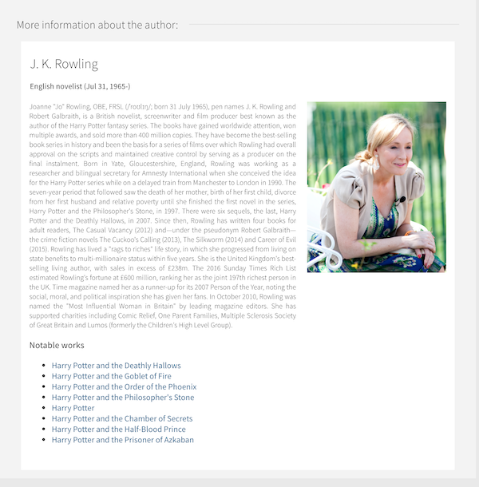

# primo-explore-lod-author-card
Adds a Linked Open Data Author Card to the full record in Primo. 

## Features
When a full record is displayed, the MMS ID is retrieved and the Alma [JSON-LD Linked Data API](https://developers.exlibrisgroup.com/alma/integrations/linked_data/jsonld/) is called. If an authorized LOC author is present with an `id.loc.gov` URI, an API version of the [UW Madison Bibcard](https://github.com/UW-Madison-Library/bibcard) library is called. The results are parsed and displayed.

### Screenshot


## Install
1. Make sure you've installed and configured [primo-explore-devenv](https://github.com/ExLibrisGroup/primo-explore-devenv).
2. Navigate to your template/central package root directory. For example:
    ```
    cd primo-explore/custom/MY_VIEW_ID
    ```
3. If you do not already have a `package.json` file in this directory, create one:
    ```
    npm init -y
    ```
4. Install this package:
    ```
    npm install primo-explore-lod-author-card --save-dev
    ```

## Usage
Once this package is installed, add `lodAuthorCard` as a dependency for your custom module definition.

```js
const app = angular.module('viewCustom', ['lodAuthorCard']);
```

Note: If you're using the `--browserify` build option, you will need to first import the module with:

```javascript
import 'primo-explore-lod-author-card';
```
