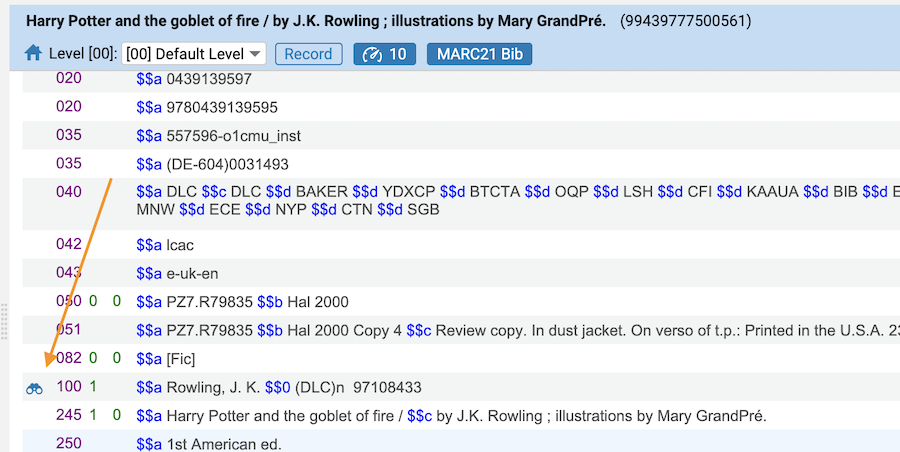

# primo-explore-lod-author-card
Adds a Linked Open Data Author Card to the full record in Primo. 

## Features
When a full record is displayed, the MMS ID is retrieved and the Alma [JSON-LD Linked Data API](https://developers.exlibrisgroup.com/alma/integrations/linked_data/jsonld/) is called. If an authorized LOC author is present with an `id.loc.gov` URI, an API version of the [UW Madison Bibcard](https://github.com/UW-Madison-Library/bibcard) library is called. The results are parsed and displayed.

### Screenshot


This add-on works for records with authors linked to LC Names authorities:



### Live examples
View these live examples:
* [Michelle Obama](https://tr-integration.primo.exlibrisgroup.com/discovery/fulldisplay?docid=alma99503141300561&vid=TR_INTEGRATION_INST:LD)
* [J. K. Rowling](https://tr-integration.primo.exlibrisgroup.com/discovery/fulldisplay?docid=alma99439777500561&vid=TR_INTEGRATION_INST:LD)

### Pre-requisites
* This add-on currently works only with Primo VE. 
* This add-on works with the [Linked Data](https://developers.exlibrisgroup.com/alma/integrations/linked_data/) features of Alma and requires that the [Linked Data integration profile](https://knowledge.exlibrisgroup.com/Alma/Product_Documentation/010Alma_Online_Help_(English)/090Integrations_with_External_Systems/030Resource_Management/200Linked_Data) be activated.

## Install
1. Make sure you've installed and configured [primo-explore-devenv](https://github.com/ExLibrisGroup/primo-explore-devenv).
2. [Download your customization package](https://knowledge.exlibrisgroup.com/Primo/Product_Documentation/020Primo_VE/Primo_VE_\(English\)/050Display_Configuration/010Configuring_Discovery_Views_for_Primo_VE#Branding_Your_View) and navigate to your template/central package root directory. For example:
    ```
    cd primo-explore/custom/MY_INST_CODE-MY_VIEW_ID
    ```
3. If you do not already have a `package.json` file in this directory, create one:
    ```
    npm init -y
    ```
4. Install this package:
    ```
    npm install primo-explore-lod-author-card --save-dev
    ```

## Usage
It's best to use the `--browserify` build option when using this library. That means placing your customization JavaScript in a separate file such as `main.js`. When building with the `--browserify` option, your code and any dependencies (such as this package) are "minified" and copied into the `custom.js` file which is used by Primo. 

In the `main.js` file, import the module and then add `lodAuthorCard` as a dependency for your custom module definition.
```javascript
import 'primo-explore-lod-author-card';

const app = angular.module('viewCustom', ['lodAuthorCard']);
```

Add the `primo-explore-lod-author-card` component to the `prmFullViewAfter` placeholder as follows:
```js
/** Linked Data Author Card */
app.component('prmFullViewAfter', {
  bindings: {parentCtrl: '<'},
  template: `<primo-explore-lod-author-card
    parent-ctrl="$ctrl.parentCtrl">
  </primo-explore-lod-author-card>`
});
/** END Linked Data Author Card */
```

Restart your development environment and test the add-on by searching for a record with an author authorized by a Library of Congress authority record.
```
gulp run --view MY_INST_CODE-MY_VIEW_ID --ve --browserify
```

Now you're ready to create your customization package and upload it to your Primo VE view using the View Management screen.
```
gulp create-package --browserify
```

## Development
To build this add-on, use:
```
npm run build
```

To publish:
```
npm publish
```

## Contributions
We welcome contributions to this community-supported add-on.
